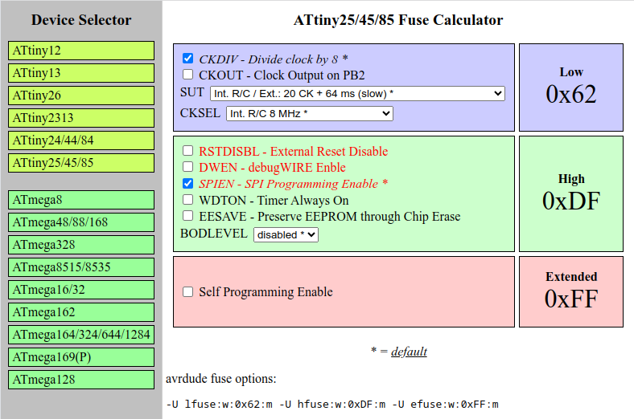

# avrfuse
Fuse calculating tool forked from [Arne's project](https://elektronik-kompendium.de/public/arnerossius/programme/web/avrfuse/avrfuse.html).

```
AVR Fuse Calculator, (C) Arne Rossius, http://www.ebps.de.vu/
```
## Usage
Open `avrfuse.html` with your browser, select a device from the list on the left side and set the fuses according to your need.
The resulting [avrdude](https://github.com/avrdudes/avrdude) fuse options are displayed in the bottom line.

## Changes
I have been using this tool for a long time and have made some small changes:

- Added ATmega328
- Naming of the components changed
- Bit order is the same as in the datasheets
- Show avrdude fuse options
